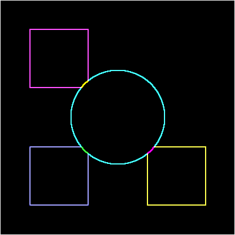

# 🖼️ C Image Processing Engine

A lightweight, zero-dependency image processing engine written in pure C for parsing and manipulating uncompressed Bitmap (`.bmp`) images.

## 📖 Overview

Unlike modern applications that rely on heavy libraries like OpenCV, this project was built from scratch in C to demonstrate a deep understanding of hardware-level data manipulation, dynamic memory allocation, and algorithmic linear algebra.

The engine parses the raw binary headers of a `.bmp` file, allocates the exact amount of contiguous memory required, transforms the RGB pixels mathematically, and then safely frees the memory to prevent leaks.

### 🎨 Visual Examples

| Original Input | Grayscale Filter | Sepia Filter | Edge Detection |
| :---: | :---: | :---: | :---: |
|  |  |  |  |

## 🚀 Engineering Highlights

*   **Why `.bmp`? (Zero Dependencies):** Unlike `.png` or `.jpg` which require complex mathematical decompression algorithms (DEFLATE, DCT) or heavy external libraries (`libpng`), the standard 24-bit Bitmap format is raw and uncompressed. This allows the engine to map the file directly into RAM and manipulate the exact RGB bytes using pointers, fulfilling the project's goal of zero external dependencies.
*   **Custom Binary Parsing:** Implements memory-aligned (`#pragma pack(push, 1)`) structures (`BMPFileHeader`, `BMPInfoHeader`) to flawlessly decode standard bitmaps directly from disk.
*   **Dynamic Memory Management:** Strictly utilizes `malloc` and `free` within the logic pipeline. Prevents *Memory Leaks* by tracking dynamically allocated Pixel arrays.
*   **Linear Algebra Transformations:**
    *   `[Grayscale]`: Uses the human-eye luminosity weighted average `(R * 0.299 + G * 0.587 + B * 0.114)`.
    *   `[Sepia]`: Applies a vintage matrix transformation across all three RGB color channels.
    *   `[Edge Detection]`: Computes image gradients using a $3\times3$ **Sobel Operator Convolution Kernel**.

## 📁 Directory Structure

```text
c-image-processor/
├── src/
│   ├── main.c           # CLI Entrypoint
│   ├── bmp.c            # File I/O and Heap Memory Allocation
│   └── filters.c        # Mathematical transformation algorithms
├── include/
│   ├── bmp.h            # Memory-aligned Struct definitions
│   └── filters.h        # Filter Headers
├── build/               # Compiled Object (.o) files
├── bin/                 # Final Executable
├── data/                # Directory for test .bmp files
├── docs/                # Documentation & Screenshots
│   └── figures/         # Example PNGs for the README
├── Makefile             # GNU Make build instructions
├── .gitignore           # C Workspace ignore rules
└── README.md            # Project documentation
```

## ⚙️ How to Run

1. Clone the repository and navigate to the project root:
   ```bash
   git clone https://github.com/leonardoalunno/c-image-processor.git
   cd c-image-processor
   ```
2. Compile the project using the provided `Makefile`:
   ```bash
   make
   ```
   *This will generate the executable `image_processor` inside the `bin/` directory.*
3. Run the executable with a filter flag, an input file, and an output file target.
   ```bash
   # Grayscale Filter
   ./bin/image_processor -g data/input.bmp data/grayscale_output.bmp
   
   # Sepia Filter
   ./bin/image_processor -s data/input.bmp data/sepia_output.bmp
   
   # Sobel Edge Detection
   ./bin/image_processor -e data/input.bmp data/edges_output.bmp
   ```

## 👨‍💻 Author

**Leonardo Alunno**  
*Aspiring Computer Engineer*  
🔗 [LinkedIn](https://www.linkedin.com/in/leonardo-alunno-3095922b7)
